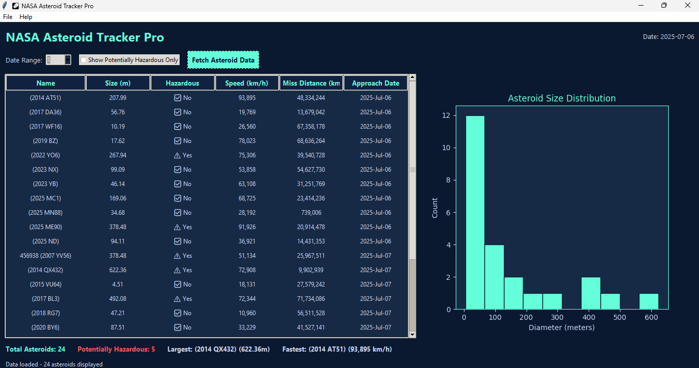

# 🌠 NASA Asteroid Tracker Pro

A modern, desktop-based asteroid tracking application that uses NASA's Near Earth Object Web Service (NeoWs) API to display and visualize asteroids that may approach Earth in the coming days. Designed with a clean, dark-themed GUI built with Python and Tkinter, this tool is perfect for space enthusiasts, students, and developers learning about API integration and data visualization.



## ✨ Features

- 🔭 Fetches asteroid data from NASA's NeoWs API  
- 📆 Selectable date range: view asteroids up to 14 days ahead  
- ⚠️ Filter to show only potentially hazardous asteroids  
- 📊 Interactive histogram of asteroid size distribution  
- 🧮 Real-time statistics: total, largest, fastest, hazardous  
- 🗃️ Export asteroid data to `.json` files  
- 🎨 Polished GUI with custom themes and styling  

## 🛠️ How to Open the Project

```bash
git clone https://github.com/bruno-moura-2804/NasaAsteroidTracker.git
cd NasaAsteroidTracker
python asteroid_tracker.py
```
## Requirements
```bash
Python 3.8+
tkinter (usually comes with Python)
matplotlib
Pillow
requests

Install missing packages using:
pip install matplotlib pillow requests
```
## 🔑 NASA API Key
To use the app with full functionality:

Visit api.nasa.gov
Sign up and get your free API key

Inside the app: click File → Load API Key and paste it

Your key will be saved locally in config.json

If no key is provided, it uses the limited DEMO_KEY.

## 📈 Data Visualization

Table View: Lists all asteroids by name, size, speed, distance, and date
Graph View: Histogram of asteroid sizes
Live Stats: Total count, largest diameter, fastest velocity, hazardous count
